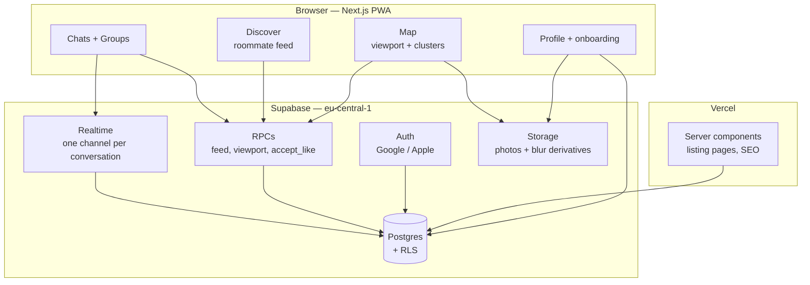

# Architecture

Companion to `DECISIONS.md`. Where this document and the register disagree, the
register wins. Sections marked **BLOCKED** cannot be written until specific rows
in the register are answered — they are listed in full at the bottom.

Scale target: **1,000 active listings, 3,000 registered renters, a few hundred
concurrent users at peak** (August–September, and the mid-year turnover).

---

## 1. System map



**The rule that shapes everything below: RLS is an authorization boundary, not a
query planner.** Reads that need filtering, ranking or pagination go through an
RPC. RLS only answers "may this user touch this row at all". Mixing the two is
how Supabase apps end up unfixably slow. *(Register: J3)*

---

## 2. Stack

| Layer | Choice | Why |
|---|---|---|
| Frontend | Next.js (App Router) on Vercel | Decided K1. Server components give real listing-page SEO, which a native app cannot have. |
| Styling | Tailwind + shadcn/ui, RTL configured from day one | Retrofitting RTL is worse than it sounds. *(I3, A7)* |
| Backend | Supabase — Postgres, Auth, Realtime, Storage | Already provisioned, eu-central-1. |
| Auth | Google (+ Apple when native ships) | B1. Apple is only mandatory *inside* a native iOS app. |
| Errors / analytics | Sentry + PostHog | J13. |

---

## 3. Environments and migrations

Today there is **one** Supabase project, it is production, and it contains six
fake listings. That has to change before anyone signs up.

- **Two projects**: `roomie-dev` and `roomie-prod`. *(J12)*
- **Migrations are numbered files in the repo**, applied to dev first, then prod.
  Never edit schema through the dashboard — the live schema already drifted from
  `supabase/schema.sql` once. *(J11)*
- Seed data lives in `supabase/seed.sql` and is applied **only** to dev.

```
supabase/
  migrations/
    0001_core_schema.sql
    0002_rls.sql
    ...
  seed.sql          # dev only
```

---

## 4. Security model

Four invariants. Each exists because the obvious implementation is wrong.

**4.1 The Pro paywall is server-side, and it withholds identity, not just pixels.**
Returning `photo_url` and blurring it in CSS means the real URL is in the network
log. But withholding *only* the photo also fails: if the client learns `user_id`,
it can fetch the sharp photo from `profiles` directly. The hype view must withhold
`user_id`, `name` and `photo_url` together for non-Pro callers. *(G2, J7)*

**4.2 `is_pro` and `is_verified` are revoked at the column level.**
RLS cannot express "any column except these two", so without an explicit
`REVOKE UPDATE (is_pro, is_verified)` any user can grant themselves Pro with one
REST call.

**4.3 Multi-write operations are RPCs, not client sequences.**
Accepting a like creates a conversation, adds two members and posts a message on
someone else's behalf. Done from the client it needs `WITH CHECK (true)` policies
that let anyone add anyone to any conversation. One `SECURITY DEFINER` function
closes it. *(J7)*

**4.4 Helper functions are not REST endpoints.**
Every `SECURITY DEFINER` function is callable at `/rest/v1/rpc/<name>` unless
execute is revoked from `anon` and `authenticated`.

---

## 5. Data model

### Settled

These entities are certain regardless of the open decisions.

- `profiles` — 1:1 with `auth.users`, cascade delete
- `conversations` / `conversation_members` / `messages` — a conversation *is* the match; upgrading to a group sets `group_id`
- `apartment_interests` — PK `(apartment_id, user_id)`; the primary key **is** the dedupe
- `apartment_reports` — same shape, same reason
- `blocks`, `user_reports` — symmetric block, one moderation queue
- `push_tokens`, `saves`

### Deliberately absent

- `groups.member_count` — a denormalised counter that drifts; `count(*)` on ≤4 rows is free
- `apartments.reports_taken` — replaced by `apartment_reports` + a maintained counter (§7)

### BLOCKED

The shape of `profiles`, `apartments` and `groups` cannot be frozen yet:

| Blocked by | Question | What it changes |
|---|---|---|
| **C1** | Are the four friction axes free tags, forced choice, or a scored vector? | Four columns vs one `text[]`. Determines whether the feed can rank at all. |
| **D1** | Who can post? | Whether `mode` keeps a `lister` value, or posting becomes an action any user takes. |
| **D9** | Is "whole apartment" the same entity as "room in an apartment"? | One table with `listing_kind`, or two tables and two map queries. |
| **E6** | Does a group have its own identity? | Whether `groups` gains `bio`/`photo`, and whether the Discover feed reads one source or two. |

---

## 6. Query strategy

### 6.1 Discover feed — **BLOCKED on C1, C3, C4, C5**

The shape is decided even though the predicate isn't:

- One RPC, `discover_feed(cursor, filters)`
- **Keyset pagination**, never `OFFSET` — offset re-scans everything it skips
- Exclusions (already liked, passed, blocked, self) as `NOT EXISTS` joins **inside** the query

The current implementation fetches every prior like and passes them as
`NOT IN (uuid, uuid, …)` in the query string. At 500 likes that's roughly 18 KB
of UUIDs in a URL, past the point where servers and proxies start rejecting it.
It is unbounded by construction. **Severity: high.**

### 6.2 Map viewport

- One RPC, `map_listings(bounds, filters, zoom)`
- Returns **only** `id, lat, lng, price, bedrooms` — never descriptions or photo arrays
- Server-side clustering below zoom 14; the client renders cluster bubbles, not pins

The current implementation fetches every active apartment with all columns and
renders one marker each. **The binding constraint is not query time** — Postgres
scans 1,000 rows in about a millisecond. It's payload size and render cost:
roughly 0.5–1 MB of JSON per map open, multiplied by every user, plus 1,000 DOM
markers. **Severity: high** (bandwidth and client render, not database).

### 6.3 Chat previews

- `conversations.last_message_id` maintained by trigger; the list reads one row per conversation

The current implementation fetches **every message across every conversation** the
user belongs to and dedupes in JavaScript. Twenty conversations of two hundred
messages is four thousand rows downloaded to render twenty previews.
**Severity: high.**

---

## 7. Counters

Trigger-maintained columns on `apartments`: `interest_count`, `report_count`.

The current `apartment_stats` view uses two correlated subqueries per apartment.
At 1,000 listings that is 2,000 index lookups per scan, uncached, on every map
load. Triggers make writes marginally more expensive and reads free, which is the
right trade for a counter read far more often than written. *(J4)*
**Severity: medium-high.**

---

## 8. Photos — **partly BLOCKED on D3, I13**

- Client resizes before upload; the browser does this for free
- Two objects per profile photo: full and a pre-blurred derivative, both written at upload time. Supabase's on-the-fly image transforms are a paid feature — generating the derivative at upload avoids depending on it. *(J9, G2)*
- Fixed aspect ratios: profiles 4:5, listings 3:2 *(I13)*

**Projected volume** (arithmetic, not a guess):

| | Count | Avg after resize | Total |
|---|---|---|---|
| Profile photos + blur derivatives | 3,000 × 2 | ~150 KB | ~0.9 GB |
| Listing photos | 1,000 × ~4 | ~300 KB | ~1.2 GB |
| | | **Total** | **~2 GB** |

Egress will exceed storage as the real cost — every map open pulls thumbnails.

---

## 9. Realtime

- One channel per conversation, subscribed only while the thread is open
- Read receipts yes, typing indicators no — typing roughly triples message volume for decoration *(F2)*
- Never subscribe to table-wide changes

---

## 10. Where the free tier stops

**This section is `RESEARCH`, not fact.** The volumes below are computed; the
platform limits must be checked against Supabase's current published numbers
before launch, not taken from me.

| Resource | Projected at target | Free tier |
|---|---|---|
| Database size | Small — well under any tier | fine |
| Storage | ~2 GB (§8) | **likely over** |
| Egress | The real constraint: map payloads + thumbnails × few hundred concurrent | **likely over** |
| Realtime concurrent connections | "A few hundred concurrent" sits right at the documented ceiling | **verify — likely the first hard wall** |
| Project pausing | Free projects pause when idle | unacceptable post-launch |

**Honest summary:** you will need Supabase Pro before launch day, and realtime
connections or egress will be what forces it — not database size. Budget for it.
Verify the current limits before the campaign, since a hard connection ceiling
during peak week is exactly the "falls over on launch day" scenario you named.

---

## 11. Failure points in what already exists

| # | Where | Problem | Severity | Fix |
|---|---|---|---|---|
| 1 | Discover feed | `NOT IN (...)` of every prior like, unbounded, in a URL | **High** — breaks for heavy users | RPC + `NOT EXISTS` (§6.1) |
| 2 | Chats tab | Fetches all messages in all conversations, dedupes in JS | **High** | `last_message_id` (§6.3) |
| 3 | Map | All listings, all columns, one marker each | **High** — bandwidth and render | Viewport RPC + clustering (§6.2) |
| 4 | `apartment_stats` | 2 correlated subqueries × 1,000 rows per scan | **Med-high** | Trigger counters (§7) |
| 5 | Realtime | Not implemented; limits unverified | **High (unknown)** | §10 |
| 6 | Environments | One project, it's production, contains fake data | **High** | §3 |
| 7 | Photos | No pipeline; `expo-image-picker` installed with nothing behind it | **Med** | §8 |
| 8 | Map interest toggle | Reads `apartment_stats` then a second query for "mine" — two round trips per tap | **Low** | Fold into the viewport RPC |
| 9 | `profiles.gender` | Column exists, nothing reads it | **Low** | Resolve C5 |
| 10 | Auto-pause | Query-time filter with no index on the predicate | **Low** | Partial index |

### On PostGIS — correcting my earlier reasoning

I first said skip it (correct for 200 listings), then said adopt it because 1,000
"stops being defensible". **Both framings were sloppy.** Precisely:

At 1,000 rows a bounding-box filter on plain `lat`/`lng` columns is *fast* —
Postgres will scan the table in about a millisecond and no index will beat that
meaningfully. PostGIS does not fix a performance problem you have at this scale.

The real reasons to adopt it are that **server-side clustering and radius search
become trivial instead of hand-rolled**, and that the address-jitter question
(D4) is a geography operation. Adopt it for those reasons, not for speed. The
thing that actually breaks at 1,000 listings is §6.2 — payload and render — and
PostGIS does not fix that; the viewport RPC does.

---

## 12. Everything blocked, in one list

| Section | Blocked by | The question |
|---|---|---|
| §5 Data model | **C1** | Four friction axes: free tags, forced choice, or scored? |
| §5 Data model | **D1** | Who can post a listing? |
| §5 Data model | **D9** | Is a room-in-an-apartment the same entity as a whole apartment? |
| §5 Data model | **E6** | Does a group have its own identity, or is it derived from members? |
| §6.1 Feed query | C3, C4, C5 | Ordering, filter set, and whether gender is a hard filter |
| §6.2 Map query | D4, D13, D14 | Address precision, filter set, clustering threshold |
| §8 Photos | D3, I13 | Photo minimums and aspect ratios |
| §10 Free tier | K3, J8 | Current Supabase limits — external fact |
| All of §2 styling | I1, I2, I3 | Brand, typeface, component library |

**C1, D1, D9 and E6 are the four that block the schema itself.** Nothing in §5
can be built until those are answered — and everything else in this document
assumes a schema.
