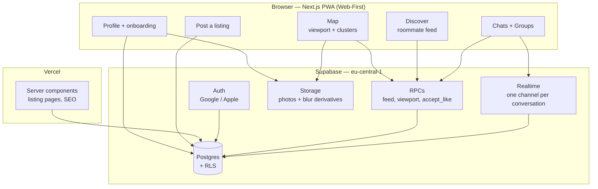

# Architecture

Companion to `DECISIONS.md`. Where this document and the register disagree, the register wins.

Scale target: **1,000 active listings, 3,000 registered renters, a few hundred concurrent users at peak**.

---

## 1. System map

**The rule that shapes everything below: RLS is an authorization boundary, not a query planner.** Reads that need filtering, ranking or pagination go through an RPC. RLS only answers "may this user touch this row at all".

---

## 2. Stack

| Layer | Choice | Why |
|---|---|---|
| Frontend | Next.js (App Router) on Vercel | Decided K1. Web-first platform to prioritize SEO and sharing. Mobile (React Native) is Phase 2. |
| Styling | Tailwind + shadcn/ui | Fast, accessible components with built-in styling. **Open (I3):** the design handoff is a bespoke, illustration-heavy system (colored icon-per-tag, custom shadow/press states) — confirm this still means shadcn primitives under a heavy skin, not a rebuild from scratch. |
| Backend | Supabase — Postgres, Auth, Realtime, Storage | Already provisioned, eu-central-1. Single DB environment for MVP to move fast. |
| Errors / analytics | Sentry + PostHog | Track funnel to signed leases. |

---

## 3. Query Strategy & Performance (Resolved Options)

Based on the architectural decisions, these are the mandated strategies for performance:

### 3.1 Map Viewport Rendering
*   **The Model:** `map_listings(bounds, zoom)` RPC powered by PostGIS.
*   **Why:** Instead of downloading 1,000 apartments with their photos and descriptions into the client memory at startup, the client asks the server only for pins visible on the screen. The payload is tiny (`id, lat, lng, price, is_favorited`). Clicking a pin runs a targeted query to fetch the heavy details.

### 3.2 Discover Feed Pagination
*   **The Model:** Server-side Keyset Pagination via RPC.
*   **Why:** Passing an unbounded array of passed/liked profiles in the client URL string (`NOT IN (...)`) breaks at scale. The database must exclude past interactions internally using `NOT EXISTS` subqueries.

### 3.3 Hype Counters
*   **The Model:** Trigger-maintained integer columns (`interest_count`).
*   **Why:** Counting all likes via correlated subqueries (`count(*)`) on every map load is too slow. Triggers keep reads instantaneous.

### 3.4 Chat Previews
*   **The Model:** A `last_message_id` reference on the `conversations` table.
*   **Why:** Fetching every message from every conversation just to build the inbox preview list causes massive payload bloat.

### 3.5 Image Processing Pipeline
*   **The Model:** Client-side compression before upload.
*   **Why:** Saves bandwidth, reduces storage costs, and offloads processing to the user's device rather than paying for server-side image transformations.

### 3.6 Data Fetching & SEO
*   **The Model:** Next.js Server Components for SEO pages, Client Components for interaction.
*   **Why:** Public apartment pages use Server-Side Rendering (SSR) to inject OpenGraph tags so WhatsApp/Facebook links render rich previews. Highly interactive screens (like the Map or swiping) use standard Client Components to talk to Supabase instantly.

---

## 4. Security Model

Four invariants. Each exists because the obvious implementation is wrong.

**4.1 The Pro paywall is server-side, and it withholds identity, not just pixels.**
The hype view must withhold `user_id`, `name` and `photo_url` together for non-Pro callers.

**4.2 `is_pro` and `is_verified` are revoked at the column level.**
RLS cannot express "any column except these two".

**4.3 Multi-write operations are RPCs, not client sequences.**
Accepting a like creates a conversation, adds two members and posts a message. This happens via one `SECURITY DEFINER` function (`accept_like`).

---

## 5. Bidirectional layout standard (I7, I9)

The app ships Hebrew (RTL) and English (LTR) from v1. Direction is a property of the locale, not of a stylesheet override. There is no RTL stylesheet and no `[dir="rtl"]` override block — if one appears, a component underneath it used a physical value and should be fixed instead.

**The rule: no component, token, or design spec contains `left` or `right`.**

| Never | Always |
|---|---|
| `margin-left` / `margin-right` | `margin-inline-start` / `margin-inline-end` |
| `padding-left` / `padding-right` | `padding-inline-start` / `padding-inline-end` |
| `left: 0` / `right: 0` | `inset-inline-start: 0` / `inset-inline-end: 0` |
| `text-align: left` | `text-align: start` |
| `border-left` / `border-right` | `border-inline-start` / `border-inline-end` |
| `border-radius: 8px 0 0 8px` | `border-start-start-radius` etc., or the 4-value logical shorthand |
| Tailwind `ml-4`, `pl-2`, `left-0`, `text-left` | `ms-4`, `ps-2`, `start-0`, `text-start` |
| `flex-direction: row-reverse` to "fix" RTL | plain `row` — the writing direction already reverses it |

**Icons.** Direction-carrying icons (back, forward, next, previous, send, chevrons, progress arrows) mirror with the locale. Non-directional icons (search, heart, user, map pin, plus, camera) never mirror. Mirror with `transform: scaleX(-1)` scoped to `[dir="rtl"]`, or ship a mirrored asset — decide once, apply everywhere.

**Content that never flips.** Phone numbers, prices with currency, dates, latitude/longitude, and email addresses stay LTR inside RTL text. Wrap them in `<bdi>` or `dir="ltr"` or they render scrambled next to Hebrew.

**Numerals.** Western Arabic numerals (0-9) in both locales. No Eastern Arabic numerals.

**Enforcement.** `dir` is set once on `<html>` from the active locale. Verify every screen in both locales before it is called done — a screen that has only been seen in Hebrew is not finished.

---

## 6. Design tokens (I2, I14, I15)

Sourced from the design handoff (`design_handoff_shutaf_design_system/`). These are decided values, not placeholders — implement as CSS custom properties / Tailwind theme extensions, not inline hex codes.

**Color**

| Token | Hex | Use |
|---|---|---|
| Orange — Primary | `#E2883A` | primary actions, brand |
| Orange Soft | `#FBE7D2` | tinted backgrounds |
| Orange Dark | `#B5661F` | button shadow/pressed state |
| Teal — Secondary | `#1F94B3` | trust, links |
| Teal hover | `#16748C` | link hover |
| Gold — Favorites | `#F0B429` | favorite/star |
| Green — Success | `#4E9F63` | success, verified, match |
| Red — Error | `#DB5A4A` | error, destructive |
| Ink | `#262220` | primary text, dark-mode surfaces |
| Body text | `#4A4340` | secondary text |
| Muted text | `#837B76` | tertiary text/labels |
| Disabled text | `#B4ACA6` | disabled states |
| Neutral bg | `#F1ECE5` / `#F8F5F1` | cards, inputs, chips |
| Border | `#E8E2DC` | card/input borders |
| Page background | `#FBF9F6` | app background |
| Teal soft | `#DCF0F5` | tinted teal backgrounds |
| Dark mode surface | `#1C1917` / `#262220` | **not used in v1 — DECISIONS.md I11 says no dark mode.** Kept here for reference only. |
| Dark mode text | `#F5F0EA` | **not used in v1** — see I11. |

**Typography**: Rubik (400/500/600/700/800/900), via Google Fonts / `next/font/google`. Display 48px/800, H1 24px/700, Body 16px/400 (1.6 line-height), Caption 13px/500. Already wired in `web/src/app/layout.tsx`.

**Shape**: radius scale 12 / 16 / 20 / 24 / 28 / pill (999px).

**Shadows**: buttons use a "pressed" hard-shadow style — `box-shadow: 0 4px 0 <dark-variant>, 0 6px 14px rgba(38,34,32,0.15)`, collapsing to `0 0 0` on `:active` with a `translateY` press.

**Spacing**: card padding 16–40px depending on density; section gaps 32–96px on desktop; mobile screen padding 20–24px.

**Icons**: hand-built inline SVG, not an icon font/library. Each nav/tag icon carries its own brand color (never a single neutral gray). Direction-carrying icons mirror per §5; non-directional icons never do.

---

## 7. Client-side state shape (from the design handoff)

Minimum state the app needs per screen group — a starting point for whatever state/data-fetching layer gets picked (React Query, Zustand, plain Server Components + `fetch`, etc. — not yet decided):

- **Session/user**: current mode (Solo/Group/Room-Filler/Lister), residency (resident vs. non-resident/no-profile), verification status, language preference.
- **Profile**: one value per structured category (single-select) — 31 categories total (16 renter + 15 apartment), per `DECISIONS.md` C1/C2.
- **Map/Discover**: viewport bounds → pin query, favorited listing IDs, Discover looking-mode (individual vs. group), swipe queue and decisions.
- **Group**: member list (≤4), shared budget, shared tags (computed from members, not stored — see `DECISIONS.md` E6).
- **Chats**: pending likes queue, active thread list, per-thread message history, unread counts.
- **Composer**: draft listing fields, required-field validation state, publish status.
- **Monetization**: Unblur Pro subscription status gating profile visibility on the interested-list.
