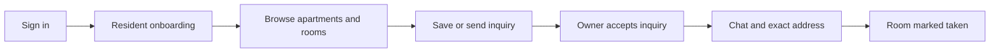

# Shutaf Development Playbook

This guide turns product decisions into a build direction. It is for choosing what to build next, working with Codex, and reviewing progress without managing Git or a terminal directly.

`DECISIONS.md` remains the product source of truth. This document decides sequence, not product rules. If a slice depends on an `OPEN` decision, settle that decision before implementation begins.

## The first journey to finish

The first useful Shutaf experience should let a Beer Sheva renter find a real available room and contact the current residents safely, entirely inside the app.

This uses the apartment-with-rooms model already in `DECISIONS.md`. It gives Shutaf one outcome to validate before groups, complex roommate matching, or professional lister workflows.

## Build order

| Order | Slice | User-visible result | Do not expand into |
|---|---|---|---|
| 0 | Integration baseline | One known `master` version, passing build, and working Preview URL | New features |
| 1 | Resident onboarding | A resident signs in, completes the required profile path, and lands on Discover or Map according to their setting | Groups, realtors, Pro |
| 2 | Publish apartment with rooms | A Room-Filler adds an apartment, available rooms and prices, bills status, photos, and private exact address | Separate public room listings |
| 3 | Browse and save | A renter sees approximate locations, prices/ranges, bills status, filters, and a persistent save | Advanced ranking |
| 4 | Inquiry to chat | A renter sends an inquiry; the poster accepts; chat opens and exact address is revealed at the decided point | Group chat, images, payments |
| 5 | Listing lifecycle | Poster marks a room taken, renews or closes a listing, and saved users get the decided notice | Admin moderation dashboard |
| 6 | Resident matching | Discover uses real profiles; like with a message; acceptance opens a chat | Groups and Pro |

Do not start a later slice because its screen is more exciting. Each earlier slice removes a dependency for the next one.

## Deliberately defer

- Groups, shared wishlist, and group-to-group logic.
- Realtor or agency journeys.
- Monetization and Pro unblur.
- Deep recommendation algorithms.
- A separate room-listing entity.
- Native mobile app work.

Keep future ideas in `ROADMAP.md`; do not add their models or partial UI to the MVP unless a current slice needs them.

## Decide only what blocks the next slice

| Before slice | Decision rows to review |
|---|---|
| Onboarding | B5 age gate, B6 public name, I9 onboarding details |
| Publishing | D6 listing expiry, D10 moderation, I13 photo ratios |
| Inquiry and chat | F1 realtime, F3 message types, F4 inquiry behavior, F5 leave thread, H1 block behavior |
| Listing lifecycle | D6 expiry, D7 taken reports, F7 notifications |
| Resident matching | C3 ordering, C4 filters, C6 message, C7 limits, C13 category grouping |

If a row does not block the current slice, leave it open.

## How to start a task

Describe the result a user should experience, not the code you expect to be written.

> A Room-Filler should publish an apartment with two available rooms at different prices. A renter should see the price range, bills status, and approximate location. Give me a plan first; do not implement until I approve it.

For a broad request, ask:

> Read `DECISIONS.md` and this playbook. Recommend the single next vertical slice, the decisions that block it, and acceptance criteria. Do not create agents or edit files yet.

Before code begins, expect a short work order: user outcome, decision IDs, expected files, non-goals, verification, and whether a worktree is justified.

## Working with agents

1. Use up to three read-only agents for an audit, each with a different question.
2. Let one coordinator recommend one slice.
3. Use one implementation owner for a normal slice. Separate worktrees are for independent outcomes with little shared state.
4. Use one read-only reviewer to check the diff against acceptance criteria.
5. Merge one branch, verify it on `master`, then continue.

Before a long task continues, ask:

> Stop and summarize active agents, file ownership, completed work, remaining work, overlap risk, and whether another agent is necessary. Do not spawn another agent yet.

## Review before integration

Require this summary before approving a merge or push:

- What a user can do now.
- Decision IDs and acceptance criteria satisfied.
- Files changed and why.
- Verification actually run: type check, lint, build, browser flow, migration check, or Preview.
- Verification still missing.
- Proposed commit title.

A type check is useful but does not prove a database-backed feature works. Browser verification against the intended environment is required before calling a user flow complete.

## Weekly rhythm

1. Choose one slice.
2. Resolve only blocking decisions.
3. Ask Codex for a work order.
4. Review the result in Preview or the local browser.
5. Ask for the review summary.
6. Approve one commit and integration.
7. Record future ideas in `ROADMAP.md`, then return to the next slice.

The goal is not to keep agents busy. It is to finish one trustworthy user journey at a time.
